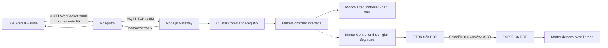

# Kế hoạch Smart Home Gateway Matter over Thread

## Hướng tiếp cận

Tạo monorepo TypeScript bằng npm workspaces gồm WebUI Vue 3, Node.js gateway và package contract dùng chung. Bản đầu chạy end-to-end qua MQTT bằng `MockMatterController`; toàn bộ MQTT, validation và UI không phụ thuộc implementation controller, nên có thể thay mock bằng Matter Controller thực sau này.

ESP32-C6 chạy OpenThread RCP. `otbr-agent` trên BeagleBone Black sở hữu độc quyền `/dev/ttyUSB0` và giao tiếp Spinel/HDLC. Node.js gateway **không mở UART và không gửi JSON xuống RCP**; nó gọi `MatterController` abstraction, còn controller thực sử dụng network interface do OTBR cung cấp để gửi Matter Invoke qua Thread.



## Cấu trúc thư mục

```text
agile-dashboard/
├─ package.json
├─ package-lock.json
├─ tsconfig.base.json
├─ .env.example
├─ .gitignore
├─ README.md
├─ packages/
│  ├─ contracts/
│  │  ├─ src/{envelope,ids,topics,index}.ts
│  │  ├─ src/clusters/{onOff,levelControl,windowCovering,vendorCooktop}.ts
│  │  └─ test/
│  └─ gateway/
│     ├─ src/{main,config,logger,errors}.ts
│     ├─ src/controller/{MatterController,MockMatterController,index}.ts
│     ├─ src/registry/{CommandRegistry,types}.ts
│     ├─ src/clusters/{onOff,levelControl,windowCovering,vendorCooktop,index}.ts
│     ├─ src/mqtt/{client,dispatcher}.ts
│     ├─ config/mock-nodes.json
│     └─ test/{unit,integration}/
├─ apps/
│  └─ webui/
│     ├─ src/services/mqttClient.ts
│     ├─ src/stores/{connection,devices,activity}.ts
│     ├─ src/components/{ConnectionBadge,OnOffCard,LevelSlider,WindowCoveringCard,CooktopPanel,ActivityLog}.vue
│     ├─ src/{main,App}.vue
│     └─ test/
└─ deploy/
   ├─ systemd/matter-gateway.service
   ├─ mosquitto/{matter.conf,aclfile}
   └─ README.md
```

## Contract Matter dùng chung

- Dùng Zod làm nguồn sự thật duy nhất cho request/response và payload từng command.
- Request giữ đúng các key bắt buộc `node_id`, `endpoint`, `cluster`, `command`, `payload`; bổ sung `request_id` UUID để correlation.
- Chuẩn nội bộ dùng ID số Matter. WebUI có thể gửi alias như `OnOff`/`On`; gateway resolve thành `0x0006`/`0x01` trước khi dispatch.
- Biểu diễn `node_id` bằng chuỗi hex tối đa 64 bit để tránh mất chính xác của JavaScript `number`.
- Cluster lõi gồm OnOff `0x0006`, LevelControl `0x0008`, WindowCovering `0x0102`; cooktop là cluster vendor-specific có `vendor_id` rõ ràng, không giả là cluster chuẩn Matter.
- Response trên `home/control/rx` giữ `request_id`, địa chỉ Matter đã normalize, `status`, `result` hoặc lỗi có mã, `latency_ms`, `timestamp`.
- Giới hạn payload 8 KiB, reject unknown top-level fields, unknown cluster/command và payload ngoài miền giá trị.

Ví dụ request:

```json
{
  "request_id": "11111111-1111-4111-8111-111111111111",
  "node_id": "0x0000000000000001",
  "endpoint": 1,
  "cluster": "OnOff",
  "command": "On",
  "payload": {}
}
```

## Gateway Node.js

1. Tạo `MatterController` interface với lifecycle, `invoke()` và event callback. Không chứa API Serial.
2. Tạo `MockMatterController` lưu trạng thái node/endpoint/cluster trong bộ nhớ và phát event khi OnOff, level, rèm hoặc cooktop thay đổi.
3. Tạo `CommandRegistry` key theo `clusterId:commandId`. Mỗi module cluster khai báo payload schema và handler riêng rồi gọi `controller.invoke()`.
4. Tạo MQTT dispatcher theo chuỗi xử lý: kiểm tra kích thước → parse JSON → validate envelope → resolve ID → resolve handler → validate payload → invoke có timeout → publish đúng một response.
5. Dùng Pino JSON logs, child logger theo `request_id`; không log password hay toàn bộ payload nhạy cảm.
6. Config qua environment gồm MQTT URL/user/password, topic, controller mode, timeout và log level. Mặc định `CONTROLLER_MODE=mock`.
7. Graceful shutdown khi nhận SIGTERM/SIGINT, đóng MQTT và controller sạch sẽ.
8. Chỉ định nghĩa interface/điểm cắm cho controller thực trong README. Không tạo serial adapter hoặc giả lập rằng `chip-tool` đã tích hợp hoàn chỉnh.

Cách thêm thiết bị/cluster mới:

1. Thêm cluster/command IDs và Zod payload schema trong `packages/contracts`.
2. Thêm một cluster module chứa các handler trong gateway.
3. Đăng ký module tại `src/clusters/index.ts`.
4. Thêm widget WebUI nếu cần; MQTT dispatcher và controller interface không đổi.

## WebUI Vue 3

- Scaffold Vue 3 + Vite + TypeScript strict + TailwindCSS + Pinia + mqtt.js.
- `mqttClient` kết nối `ws://<gateway>:9001`, subscribe `home/control/rx`, và quản lý Map pending request theo `request_id` với timeout.
- Pinia stores tách connection status, normalized device state và activity log.
- Widget dùng helper chung để tạo envelope, không tự ghép JSON rải rác.
- Tạo card mẫu cho công tắc, slider LevelControl, rèm và cooktop vendor-specific.
- Validate response/event trước khi cập nhật store; trạng thái realtime đến từ response hoặc event trên RX.
- Không coi biến `VITE_*` là bí mật. Development có thể dùng env; triển khai thực dùng MQTT account giới hạn ACL và nên chuyển WebSocket sang WSS.

## Mosquitto và systemd trên BBB

- Mosquitto TCP `1883` chỉ bind loopback cho gateway; WebSocket `9001` phục vụ WebUI.
- Tắt anonymous, dùng password file và ACL tách user `gateway` với user `webui`.
- Gateway được quyền read TX/write RX; WebUI được quyền write TX/read RX, không cấp wildcard `#`.
- `matter-gateway.service` chạy bằng user không đặc quyền, đọc `/etc/matter-gateway/gateway.env`, restart on failure và ghi JSON logs vào journald.
- Hardening systemd dùng `PrivateDevices=yes`; user gateway không thuộc nhóm `dialout`. Điều này bảo đảm Node.js không tranh `/dev/ttyUSB0` với `otbr-agent`.
- README ghi rõ prerequisite BBB, ESP32-C6 firmware `ot_rcp`, OTBR radio URL và khuyến nghị udev symlink ổn định. Không tự động cấu hình dataset/commissioning trong scaffold.

## Kiểm thử

- Contracts: request hợp lệ/không hợp lệ, node ID 64 bit, alias → numeric ID, payload range và unknown fields.
- Registry/handlers: duplicate registration, unknown cluster/command, từng command của bốn cluster.
- Mock controller: state transition và emitted events.
- MQTT integration dùng broker Aedes in-process: OnOff happy path, invalid JSON, invalid payload, unknown cluster, timeout và hai request đồng thời vẫn correlation đúng.
- WebUI: MQTT request correlation/timeout và device store cập nhật từ response/event.
- Chạy `npm run typecheck`, `npm test`, `npm run build` sau khi cài dependencies.

## Trình tự triển khai

1. Tạo root workspace, TypeScript config, scripts và env mẫu.
2. Implement `@agile/contracts` cùng unit tests.
3. Implement gateway config/logging, controller interface/mock, registry và cluster handlers.
4. Implement MQTT dispatcher và integration tests.
5. Scaffold WebUI, Pinia stores, MQTT service, widgets và UI tests.
6. Thêm Mosquitto/systemd templates và tài liệu BBB/OTBR.
7. Cài dependencies, chạy typecheck/tests/build; sửa mọi lỗi phát hiện.
8. Chạy local end-to-end với mock controller và xác minh TX/RX bằng một request OnOff.

## Tiêu chí hoàn tất

- WebUI gửi đủ Matter envelope và cập nhật state realtime qua MQTT.
- Mọi request parse được tạo đúng một response có cùng `request_id`.
- Handler được chọn bằng registry, không có switch tập trung phải sửa mỗi khi thêm cluster.
- Mock mode chạy end-to-end và các test/typecheck/build đều đạt.
- Gateway không có code mở UART; tài liệu và systemd enforce OTBR là tiến trình duy nhất sở hữu RCP.
- Secrets không được commit; ACL tách đúng quyền WebUI và gateway.
