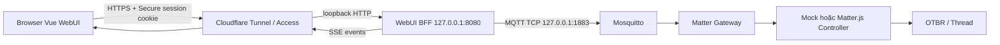

# Kế hoạch Production Web Authentication

## Mục tiêu

Loại bỏ hoàn toàn MQTT credential khỏi browser. Người dùng đăng nhập tại `https://dashboard.rhophi.uk`; browser nhận session cookie `HttpOnly Secure`, gửi command qua HTTPS REST và nhận realtime state qua authenticated SSE. BBB giữ MQTT credential nội bộ. Cloudflare Tunnel cung cấp public TLS mà không mở inbound port trên router.

## Kiến trúc đề xuất



BFF là service/process riêng để giữ Web trust boundary tách khỏi Gateway/Matter RPC privileges. Matter/Thread path không thay đổi.

## 1. HTTP contracts dùng chung

Tạo `packages/contracts/src/http.ts` và export từ contract index.

- login request
- session info và CSRF token
- browser command input không có `request_id`
- API error codes
- SSE envelopes cho `snapshot`, `response`, `event`, `status`
- giữ giới hạn body 8 KiB

BFF sinh UUID/request ID ở server. Browser không còn phụ thuộc Web Crypto secure-context UUID.

## 2. Package `@agile/webui-bff`

Tạo package mới bằng Node built-ins + `mqtt`, `zod`, `pino`; không dùng Express hay native password dependency.

### Authentication

- một admin account
- password hash bằng async `crypto.scrypt`
- random salt 32 bytes, key 32 bytes, `timingSafeEqual`
- dummy scrypt cho username sai để giảm timing leak
- password nhập qua stdin khi installer tạo hash, không xuất hiện argv/history
- global login token bucket và per-IP/username lockout

### Sessions

- cookie `__Host-sid`
- `HttpOnly; Secure; SameSite=Strict; Path=/`
- absolute lifetime 7 ngày
- idle lifetime 24 giờ
- rotate SID sau login
- logout thu hồi session
- chỉ lưu SHA-256 hash của random SID
- persistent bounded session store dưới `/var/lib/matter-webui/sessions.json`
- atomic write, throttle last-seen persistence để giảm eMMC writes
- đổi admin password tăng session version và thu hồi mọi session cũ

### CSRF và origin

- state-changing API yêu cầu `Content-Type: application/json`
- exact `Origin=https://dashboard.rhophi.uk`
- `Host=dashboard.rhophi.uk`
- `X-CSRF-Token` phải khớp session
- chỉ tin `CF-Connecting-IP` khi socket peer là loopback cloudflared
- giới hạn request body trước JSON parse

### API

| Route | Chức năng |
|---|---|
| `POST /api/login` | xác thực, rotate session, set cookie |
| `POST /api/logout` | revoke session/cookie |
| `GET /api/session` | khôi phục phiên sau reload/reopen browser |
| `POST /api/command` | validate, sinh request ID, publish MQTT và chờ correlated response |
| `GET /api/events` | SSE snapshot/response/event/status |
| `GET /api/health` | health không chứa secret |
| `GET /*` | static Vite files |

### MQTT bridge server-side

- một connection tới `mqtt://127.0.0.1:1883`
- dùng account ACL `webui`, credential chỉ ở `/etc/matter-webui/webui.env`
- subscribe RX/status
- pending request Map có timeout và max inflight
- response resolve caller đồng thời fanout SSE
- event/status fanout SSE
- server-side device cache gửi `snapshot` ngay khi mở SSE

### SSE

- heartbeat 15 giây để sống qua Cloudflare
- `Cache-Control: no-cache, no-transform`
- `X-Accel-Buffering: no`
- event IDs + bounded replay ring cho reconnect
- giới hạn client và buffer/backpressure
- đóng stream khi session hết hạn/logout

### Static/security headers

- path traversal protection
- immutable cache cho hashed assets, `no-store` cho index
- CSP, nosniff, no-referrer, frame-ancestors none, permissions policy

## 3. WebUI migration

- thay `MqttLogin.vue` bằng `LoginForm.vue`, chỉ username/password
- thay `mqttClient.ts` bằng `apiClient.ts` và `sseClient.ts`
- thêm Pinia `session` store
- `App.vue` gọi `/api/session` khi mount; tự vào Dashboard nếu cookie còn hợp lệ
- widgets giữ API `sendCommand` tương đương để diff nhỏ
- badge phân biệt session, SSE và Gateway status
- bỏ dependency browser `mqtt`
- bỏ `VITE_MQTT_*`
- thêm Logout và session-expired flow

Người dùng không phải tìm MQTT password. Phiên sống qua reload, browser restart và BFF restart trong giới hạn 7 ngày/24 giờ idle.

## 4. Mosquitto hardening

- giữ `listener 1883 127.0.0.1`
- xóa listener WebSocket 9001 sau khi BFF acceptance đạt
- giữ anonymous off và ACL gateway/webui
- MQTT webui password chỉ server-side
- xóa `webui-login.txt`
- firewall xác nhận không còn 9001 public

## 5. systemd và filesystem

Thay `matter-webui.service` Python server bằng BFF.

```text
/opt/matter-webui/webui-bff.cjs
/opt/matter-webui/public/*
/etc/matter-webui/webui.env
/etc/matter-webui/admin.env
/var/lib/matter-webui/sessions.json
```

- user `matter-webui`
- bind `127.0.0.1:8080`
- `StateDirectory=matter-webui`
- MemoryMax 128 MiB
- hardening hiện có cộng PrivateTmp, empty capability set, namespace/SUID restrictions
- After/Wants Mosquitto/network

Gateway, Matter Controller, OTBR và Thread dataset không thay đổi.

## 6. Cloudflare Tunnel cho `dashboard.rhophi.uk`

Domain `rhophi.uk` đã active trên Cloudflare.

Các bước operator cần thực hiện tương tác:

1. tạo named Tunnel `matter-home`
2. route DNS `dashboard.rhophi.uk`
3. cài `cloudflared` ARM package phù hợp BBB
4. lưu tunnel credential dưới `/etc/cloudflared`
5. ingress tới `http://127.0.0.1:8080`
6. không set `httpHostHeader`, giữ original Host để BFF kiểm tra
7. tắt Rocket Loader/Auto Minify cho app/SSE
8. bật Always HTTPS và HSTS sau acceptance
9. phase sau bật Cloudflare Access MFA cho admin

Không gửi tunnel token/credential vào chat hoặc Git.

Cloudflare Tunnel/SSL/DNS/Access dùng free tier; domain là chi phí riêng.

## 7. Resource guard trên BBB

Ước tính tổng RAM sau BFF + cloudflared vẫn trong giới hạn nhưng BBB chỉ có 482 MiB và không swap.

- build/bundle trên Windows/CI, không npm build trên BBB
- đo RSS sau cutover
- giới hạn BFF/cloudflared bằng systemd
- cân nhắc zram-swap trước public cutover
- giữ ít nhất 250 MiB disk free

## 8. Tests bắt buộc

### Unit

- scrypt hash/verify/malformed record
- session create/rotate/idle/absolute expiry/revoke/persistence
- CSRF compare và Origin/Host validation
- rate limit/lockout/global limiter
- SSE frame/replay/heartbeat/backpressure
- static traversal/security headers

### Integration

- login đúng/sai/lockout
- cookie + CSRF command
- MQTT correlation qua Aedes
- SSE snapshot/event/status
- logout/session expiry
- BFF restart vẫn giữ valid session
- không response/log nào chứa MQTT password

### BBB acceptance

- loopback `/api/health`
- public HTTPS login qua Tunnel
- reload/browser restart không cần nhập lại trong session lifetime
- command round-trip và SSE ở hai tab
- wrong Origin/Host/CSRF bị chặn
- full reboot tự phục hồi
- `ss` không còn public 9001
- Matter/Thread services không bị ảnh hưởng

## 9. Migration và rollback

1. Build/test BFF và WebUI off-device.
2. Cài Cloudflare Tunnel nhưng giữ WebUI/MQTT 9001 cũ.
3. Snapshot `/opt/matter-webui` và old unit.
4. Cài BFF trên loopback 8080; verify local auth/API/SSE.
5. Verify `https://dashboard.rhophi.uk` end-to-end.
6. Chỉ sau khi pass mới xóa public listener 9001, rotate broker credential và xóa login file.

Rollback trước bước 6 khôi phục Python WebUI/unit cũ. Rollback sau bước 6 còn phải khôi phục listener 9001. Gateway, Matter Controller, OTBR và Thread dataset nằm ngoài migration scope.

## 10. Documentation updates

Cập nhật:

- `README.md`
- `docs/00-huong-dan-he-thong-hien-tai.md`
- `docs/full-context/00`, `03`, `06`, `10`
- Web course chapters MQTT/backend/security
- Linux course hardening/deployment
- `deploy/README.md`
- Cloudflare Tunnel setup, verification và rollback runbook

## Critical files

- `apps/webui/src/services/mqttClient.ts` — logic correlation cần chuyển server-side rồi xóa
- `apps/webui/src/App.vue` — session bootstrap/login/logout/SSE
- `packages/contracts/src/envelope.ts` — nguồn contract hiện tại
- `packages/gateway/src/main.ts` — mẫu config/logging/shutdown
- `deploy/mosquitto/matter.conf` — xóa 9001 ở cutover gate
- `deploy/systemd/matter-webui.service` — thay Python bằng BFF
- `deploy/bbb/install-production.sh` — secrets/artifacts/migration
- `docs/00-huong-dan-he-thong-hien-tai.md` — hướng dẫn người mới phải phản ánh flow mới
