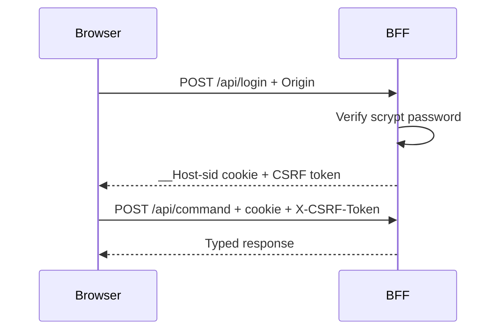

# Chương 2 — BFF, session và authentication

## Mục tiêu

- hiểu web cookie flow và Mobile bearer flow
- biết Origin, Host, CSRF và rate limit bảo vệ gì
- biết session nằm ở đâu và mất session ảnh hưởng thế nào

## Web login flow



Cookie phải là HttpOnly, Secure, SameSite và Path `/`. Web POST cần exact Origin/Host và CSRF. BFF không gửi MQTT credential cho browser.

## Mobile flow

Mobile dùng `POST /api/mobile/login`, nhận opaque bearer token rồi gửi `Authorization: Bearer ...`. BFF lưu digest, không persist raw bearer. Android mã hóa token bằng AES-256-GCM với key non-exportable trong Android Keystore.

## Session lifecycle

| Trạng thái | Kết quả |
|---|---|
| Login đúng | Tạo web hoặc mobile session |
| Session expired/idle | `401 UNAUTHENTICATED` |
| Origin sai | `403 FORBIDDEN_ORIGIN` |
| Web CSRF sai | `403 CSRF_INVALID` |
| Credential sai lặp lại | Rate limiting |
| Logout | Revoke session và đóng quyền truy cập |

Session state thuộc BFF state directory. Mất state làm client login lại nhưng không làm mất Matter fabric.

## Negative tests

```bat
curl.exe -i -X OPTIONS https://dashboard.rhophi.uk/api/mobile/login -H Origin:https://invalid.example -H Access-Control-Request-Method:POST
curl.exe -i https://dashboard.rhophi.uk/api/session -H Origin:https://localhost
```

Không brute-force production. Rate-limit lab phải chạy trên local test BFF.

## Checkpoint

Hoàn thành khi bạn phân biệt được cookie, CSRF token, bearer token, bearer digest và MQTT password.
