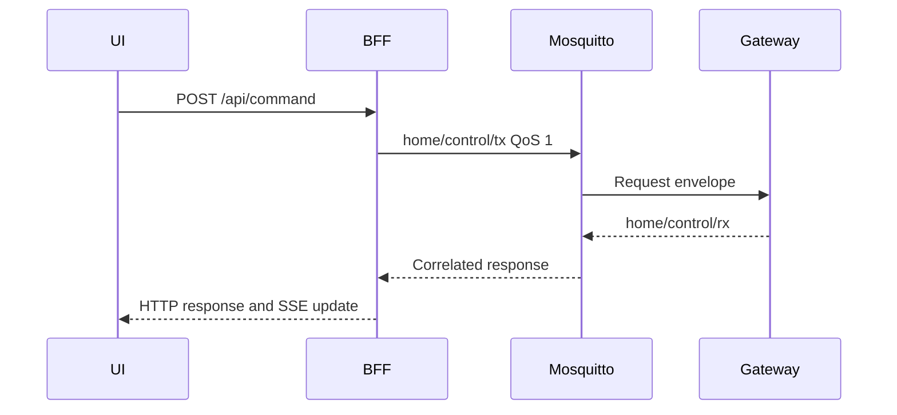

# Chương 3 — REST, SSE và realtime state

## Mục tiêu

- hiểu vì sao public client không kết nối MQTT trực tiếp
- theo dõi command correlation và realtime fanout
- biết giới hạn của SSE hiện tại

## API surface

| Endpoint | Vai trò |
|---|---|
| `POST /api/login` | Web login |
| `POST /api/mobile/login` | Mobile bearer login |
| `GET /api/session` | Session restore |
| `POST /api/logout` | Revoke session |
| `POST /api/command` | Typed command tới Gateway |
| `GET /api/events` | Authenticated SSE stream |
| `GET /api/health` | BFF/MQTT summary |

## Command data flow



Gateway hiện mock Controller. HTTP/SSE thành công chưa chứng minh relay thật đổi state.

## SSE

Server gửi event ID, event type, JSON data, retry hint và comment ping. Mobile dùng fetch stream vì `EventSource` không gắn bearer header theo nhu cầu hiện tại. Client hỗ trợ chunk boundary, CRLF, multiline data, reconnect và `Last-Event-ID`.

Giới hạn hiện tại là server chưa có durable replay log. `Last-Event-ID` hỗ trợ reconnect protocol nhưng không bảo đảm phát lại event đã mất.

## Quan sát

```bat
curl.exe -i https://dashboard.rhophi.uk/api/health
curl.exe -N https://dashboard.rhophi.uk/api/events
```

Lệnh thứ hai không có session phải nhận `401`, không phải stream công khai.

## Checkpoint

Hoàn thành khi bạn mô tả được request ID đi từ REST qua MQTT rồi quay về HTTP/SSE như thế nào.
