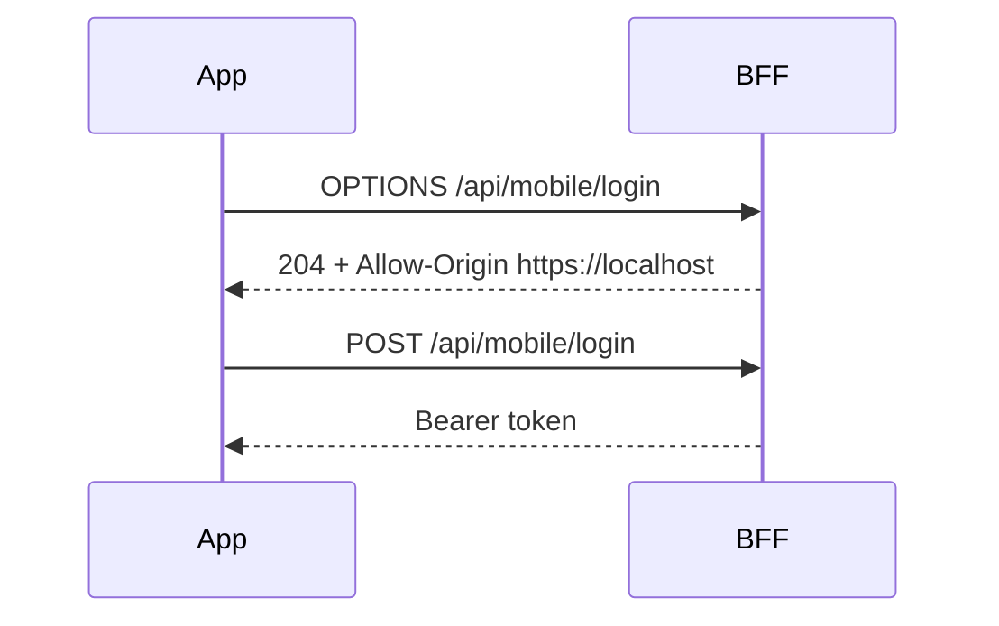

# Chương 4 — Mobile bearer, CORS và Android security

## Mục tiêu

- hiểu Capacitor origin và CORS preflight
- hiểu token đi qua các tầng nào
- phân biệt mobile source với dashboard source

## Origin và CORS

Capacitor Android dùng scheme `https`, nên WebView có origin `https://localhost`. Trước request JSON, WebView gửi preflight.



Allowed methods gồm GET, POST, OPTIONS. Allowed headers cần Authorization, Content-Type và Last-Event-ID.

## Token path

1. BFF tạo random bearer session.
2. BFF persist SHA-256 digest, không persist raw token.
3. Mobile chuyển token vào Capacitor `SecureSession` plugin.
4. Android Keystore giữ AES key không export được.
5. SharedPreferences chỉ giữ ciphertext và IV.
6. Pinia giữ username/auth state, không phải raw token source of truth.

## Hai repository, một API

Mobile contracts nằm trong `mobileapp-reference/packages/client-sdk`. Dashboard/BFF có contracts riêng. Khi đổi endpoint, error code, field hoặc SSE envelope phải sửa cả hai repository và chạy compatibility tests.

## Lỗi thường gặp

| Lỗi | Nguyên nhân |
|---|---|
| `Illegal invocation` | Global `fetch` bị lưu/call sai receiver trong WebView |
| `Failed to fetch` | CORS, DNS, TLS hoặc network failure |
| `FORBIDDEN_ORIGIN` | `https://localhost` chưa nằm trong allowlist |
| Restore về Login | token mất, expired hoặc BFF session bị revoke |

## Probe an toàn

```bat
curl.exe -i -X OPTIONS https://dashboard.rhophi.uk/api/mobile/login -H Origin:https://localhost -H Access-Control-Request-Method:POST -H Access-Control-Request-Headers:content-type
```

## Checkpoint

Hoàn thành khi bạn giải thích được vì sao `targetSdkVersion` không liên quan đến CORS và vì sao không lưu bearer token bằng plaintext localStorage.
