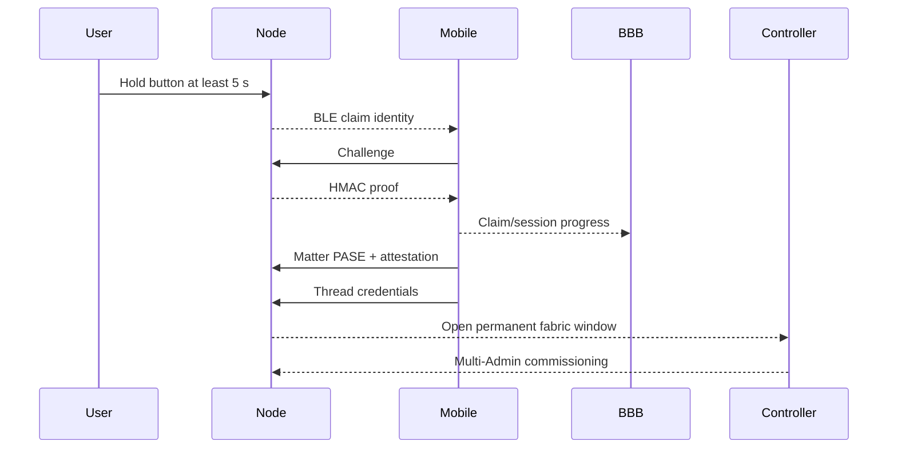

# Chương 5 — Commissioning, claim và Controller API

## Mục tiêu

- phân biệt claim, Matter commissioning và Multi-Admin
- biết phần nào đã có source và phần nào chưa HIL
- không dùng MQTT làm commissioning protocol

## Ba giai đoạn

| Giai đoạn | Mục đích | Trạng thái |
|---|---|---|
| Rhophi claim | Chứng minh physical device đúng product/secret | Firmware/source-partial |
| Matter BLE commissioning | PASE, attestation, cấp Thread/fabric | PLANNED trên Mobile |
| BBB fabric handoff | On-network Multi-Admin và remove temp fabric | PLANNED/HIL thiếu |

## Target flow

Claim proof không phải Matter attestation. Thread attach không đồng nghĩa BBB đã sở hữu permanent fabric. UI complete state không được đánh dấu pass nếu temporary fabric chưa được remove.

## Security requirements

- challenge và nonce bounded, random và không reuse
- compare proof constant-time
- secret không trả qua BLE
- claim grant phải có expiry và anti-replay
- Thread dataset không log hoặc gửi MQTT
- failure/cancel phải cleanup temporary state

## Controller gaps

RPC hiện có `health`, `listNodes`, `invoke`. Đường production còn cần commission, remove, explicit read, subscribe, describe node và restore subscriptions.

## Bài thực hành

1. Đọc [Matter/Thread commissioning](../matter-thread-course/07-commissioning.md).
2. Đối chiếu [firmware claim protocol](../../../docs/architecture/rhophi-claim-protocol.md).
3. Vẽ state nào thuộc Mobile, Node, BFF và Controller.

## Checkpoint

Hoàn thành khi bạn giải thích được vì sao BLE claim thành công vẫn chưa đủ để điều khiển node qua BBB.
