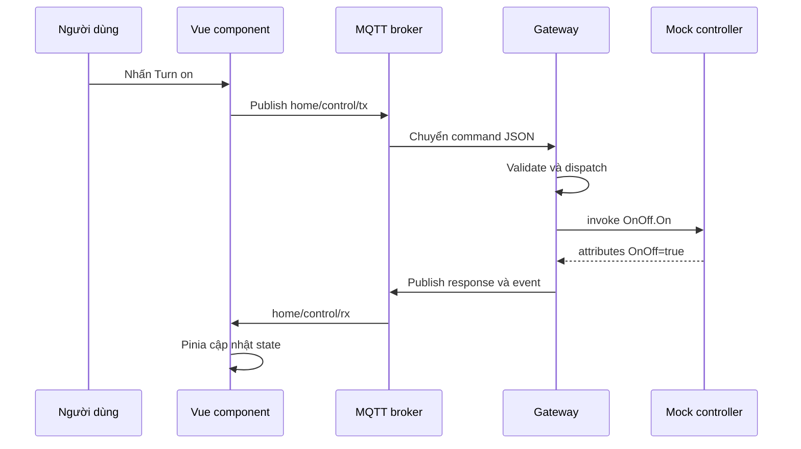

# Chương 1 — Một ứng dụng Web có những gì

## Mục tiêu

- phân biệt frontend, backend và message broker
- hiểu dữ liệu, giao diện, logic và hạ tầng là các mối quan tâm khác nhau
- lần theo một cú nhấn nút qua toàn hệ thống

## Bốn lớp của Dashboard

### Frontend

Frontend chạy trong trình duyệt. Nó hiển thị giao diện, nhận thao tác và giữ state dùng cho màn hình.

Trong dự án này, frontend nằm tại `apps/webui`.

### Backend

Backend chạy trên gateway Linux. Nó nhận dữ liệu từ bên ngoài, kiểm tra, điều phối nghiệp vụ và trả kết quả.

Trong dự án này, backend nằm tại `packages/gateway`.

### Hợp đồng dữ liệu

Frontend và backend phải thống nhất một thông điệp có hình dạng gì. Package `packages/contracts` là nguồn sự thật chung, tránh hai phía tự định nghĩa khác nhau.

### Hạ tầng truyền tin

Mosquitto hoặc Aedes là MQTT broker. Broker nhận message từ publisher và chuyển cho subscriber theo topic. Broker không quyết định bếp nên bật mức mấy. Nó chỉ vận chuyển message.

## Luồng của nút bật đèn

## Đọc mã trong dự án

| File | Vai trò |
|---|---|
| `apps/webui/src/components/OnOffCard.vue` | tạo command từ thao tác người dùng |
| `apps/webui/src/services/mqttClient.ts` | gửi và nhận MQTT |
| `packages/gateway/src/mqtt/dispatcher.ts` | validation và điều phối command |
| `packages/gateway/src/controller/MockMatterController.ts` | mô phỏng trạng thái thiết bị |
| `apps/webui/src/stores/devices.ts` | đưa attribute mới vào state giao diện |

## Các khái niệm không nên trộn lẫn

- giao diện không nên tự mở serial port
- broker không nên chứa logic Matter
- component không nên tự parse mọi kiểu response
- gateway không nên biết cách vẽ nút
- contract không nên phụ thuộc giao diện

Tách mối quan tâm làm code dễ thay đổi và kiểm thử hơn.

## Bài thực hành

Vẽ lại sơ đồ trên giấy. Đánh dấu nơi dữ liệu chuyển từ object TypeScript thành chuỗi JSON và nơi chuỗi được parse trở lại.

## Tự kiểm tra

1. Broker có phải backend không?
2. Tại sao cần package contracts?
3. State của giao diện nằm ở đâu?
4. Mock controller khác thiết bị Matter thật thế nào?
